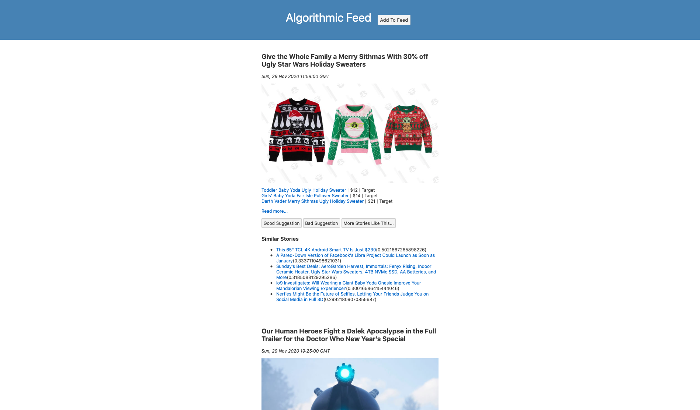

# Algorithmic Newsfeed

Simple newsfeed that uses **cosine similarity** to prioritize articles for user. Articles that the user reported as 'good suggestions', increase the likelihood of similar articles appearing.

There is also a "More Stories Like This..." to explicitly request a list of similar stories and their cosine similarity score.

*Screenshot:*

